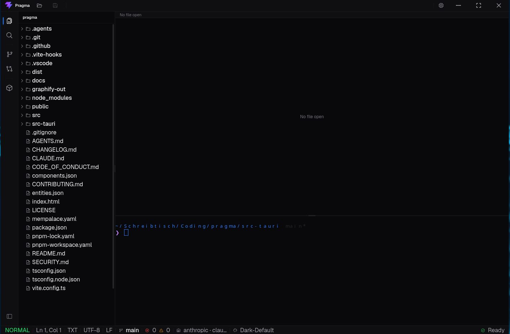
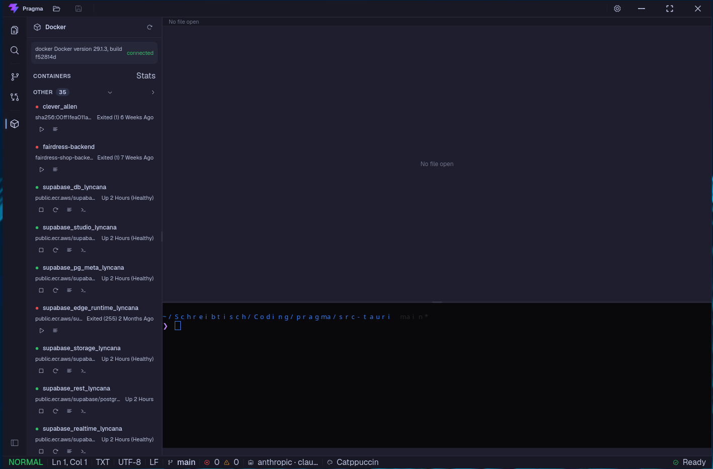
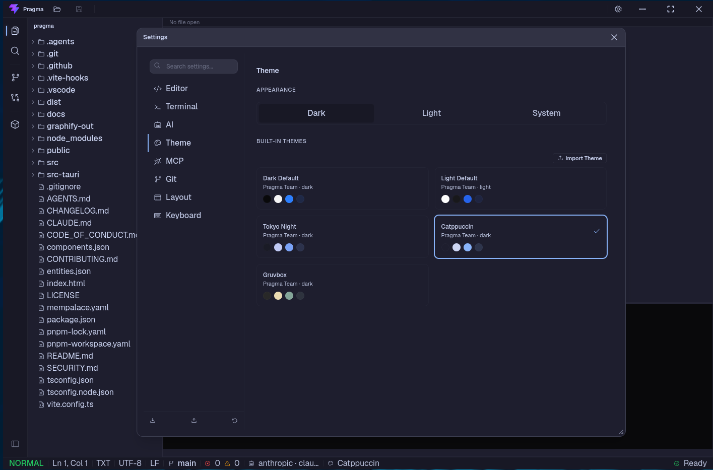

# Pragma

A lightweight, AI-native desktop IDE with an integrated terminal.

Built with Tauri 2, Rust, React 19, TypeScript and CodeMirror 6.

<p align="center">
  
  <br>
  <em>The Pragma home screen with editor, terminal and sidebar.</em>
</p>

<p align="center">
  <a href="#what-is-pragma">What is Pragma?</a> •
  <a href="#features">Features</a> •
  <a href="#tech-stack">Tech Stack</a> •
  <a href="#installation">Installation</a> •
  <a href="#build-from-source">Build from Source</a> •
  <a href="#quick-start">Quick Start</a> •
  <a href="#configuration">Configuration</a> •
  <a href="#contributing">Contributing</a> •
  <a href="#license">License</a>
</p>

---

## What is Pragma?

Pragma is a desktop code editor designed for developers who want AI assistance without the bloat of a browser-based IDE.

Most existing tools add AI through plugins that feel bolted on or treat the terminal as a secondary panel. Pragma takes a different approach:

- **AI-native.** AI features are integrated directly into the editor, terminal and chat panel. No separate browser window or extension required.
- **Integrated terminal.** A full xterm.js terminal with tabs, splits and AI-driven command suggestions, built into the workflow instead of tucked away.
- **Lightweight.** Built with Tauri 2 and Rust instead of Electron. The compressed Linux package is under 10 MB.
- **Private by default.** API keys are stored in the operating system's keychain, not in plain text.
- **Hackable.** VIM mode, custom themes, configurable AI provider profiles and MCP server support.

Pragma is currently in early development. The core editor, terminal, AI chat and Git panels are functional. LSP and MCP support are on the roadmap.

---

## Features

### Editor

- CodeMirror 6 with syntax highlighting for many languages.
- Optional VIM mode.
- Inline ghost text suggestions powered by AI.
- AI diff/edit workflow: select code, ask for changes, review a side-by-side diff and accept or reject.
- Configurable font, tab size, line numbers and word wrap.

### Terminal

- xterm.js terminal with portable-pty backend.
- Multiple tabs and split layouts.
- Configurable shell (zsh, bash, fish, PowerShell).
- AI command suggestions while typing.

### AI Chat

- Codebase-aware chat using the Vercel AI SDK.
- Streaming responses with Markdown rendering.
- Reference files or folders with `@filename`.
- Support for multiple providers: OpenAI, Anthropic, Ollama, Gemini, DeepSeek, Kimi and OpenAI-compatible endpoints.
- API keys stored in the OS keychain.

### Git Integration

- Visual Git graph in the sidebar.
- Git status panel with staged and unstaged changes.
- Inline diff previews.
- Stage, unstage, commit, push and pull from the UI.

### Docker Integration

- Docker and Podman container overview in the sidebar.
- Start, stop and restart containers.
- Open container logs or exec a shell directly from the UI.
- Docker Compose support: up, down, build and restart.
- Project-aware grouping of containers based on `docker-compose.yml`.

<p align="center">
  
  <br>
  <em>The Docker panel in the sidebar.</em>
</p>

### MCP Support

- Manage Model Context Protocol servers from the sidebar.
- Configure servers in `~/.config/pragma/mcp.json`.
- Start, stop and monitor MCP server processes.

### Customization

- Built-in themes plus user-loadable JSON themes.
- Configurable keyboard shortcuts.
- Resizable and collapsible panels.
- Native floating windows for detaching panels.

---

## Tech Stack

| Layer              | Technology                               |
| ------------------ | ---------------------------------------- |
| Frontend framework | React 19                                 |
| Language           | TypeScript                               |
| Styling            | Tailwind CSS v4, shadcn/ui               |
| State management   | Zustand                                  |
| Build tool         | Vite+ (`vp dev`, `vp build`, `vp check`) |
| Editor             | CodeMirror 6                             |
| Terminal           | xterm.js                                 |
| Desktop framework  | Tauri 2                                  |
| Backend language   | Rust                                     |
| AI SDK             | Vercel AI SDK                            |
| Package manager    | pnpm 11.5.0                              |

---

## Installation

### Download a release

Pre-built binaries for macOS, Windows and Linux will be published on the [Releases](https://github.com/NiklasTech/pragma/releases) page once the release pipeline is complete.

Until then, build Pragma from source.

---

## Build from Source

### Prerequisites

You need the following tools installed:

- [Node.js](https://nodejs.org/) 24 or later
- [pnpm](https://pnpm.io/) 11.5.0 or later
- [Rust](https://www.rust-lang.org/tools/install) stable toolchain
- Tauri system dependencies for your operating system

#### macOS

Install Xcode Command Line Tools:

```bash
xcode-select --install
```

#### Windows

Install the [Microsoft C++ Build Tools](https://docs.microsoft.com/en-us/windows/dev-environment/rust/setup) and enable the Windows SDK.

#### Linux (Debian/Ubuntu)

```bash
sudo apt update
sudo apt install libwebkit2gtk-4.1-dev libgtk-3-dev libappindicator3-dev librsvg2-dev patchelf
```

#### Linux (Arch / CachyOS)

```bash
sudo pacman -S webkit2gtk-4.1 gtk3 libappindicator librsvg patchelf
```

For other distributions, see the [Tauri prerequisites guide](https://v2.tauri.app/start/prerequisites/).

### Clone and install

```bash
git clone https://github.com/NiklasTech/pragma.git
cd pragma

# Install dependencies
pnpm install

# Start the frontend development server
pnpm exec vp dev

# Start the full Tauri desktop app
pnpm exec vp run tauri dev
```

If you have the Vite+ CLI installed globally, you can also use `vp install`, `vp dev` and `vp run tauri dev` without the `pnpm exec` prefix.

> **Shortcut:** All commands above are also available as `pnpm run` scripts:
>
> ```bash
> pnpm run dev          # frontend dev server
> pnpm run dev:desktop  # full Tauri desktop app
> pnpm run build        # frontend production build
> pnpm run build:desktop # Tauri release build
> pnpm run check        # lint + format + type check
> pnpm run test         # run tests once
> ```

### Build a release binary

```bash
# Build the frontend and the Tauri application
pnpm exec vp run tauri build
```

> **Note on `vp`:** Pragma uses [Vite+](https://viteplus.dev/) as its build toolchain. The `vp` command is available through `pnpm exec vp ...` after running `pnpm install`, or by installing Vite+ globally with `pnpm add -g vite-plus`.

The resulting bundles are written to `src-tauri/target/release/bundle/`.

To build only specific package formats, for example `.deb` and `.rpm` on Linux:

```bash
pnpm exec vp run tauri build --bundles deb,rpm
```

### Run checks

Before committing, run the full check suite:

```bash
pnpm exec vp check
pnpm exec vp test
cd src-tauri && cargo test
```

---

## Quick Start

1. Start Pragma and complete the onboarding dialog.
2. Select a theme and configure your preferred AI provider.
3. Open a project folder using the file explorer in the sidebar.
4. Open any file in the editor.
5. Open the AI chat panel with `Cmd/Ctrl + Shift + A`.
6. Reference a file by typing `@filename` in the chat input.
7. Toggle the terminal with `Cmd/Ctrl + J`.

---

## Configuration

Pragma stores user configuration in the Tauri store and in config files under `~/.config/pragma/`.

<p align="center">
  
  <br>
  <em>The settings panel for configuring editor, terminal and AI options.</em>
</p>

### AI providers

Add provider API keys through the Settings panel. Supported providers include:

- OpenAI
- Anthropic
- Ollama
- Gemini
- DeepSeek
- Kimi
- OpenAI-compatible custom endpoints

API keys are stored in the OS keychain.

### Themes

Built-in themes can be selected in the settings panel. Custom themes can be added as JSON files in:

```
~/.config/pragma/themes/
```

Each theme file defines colors, fonts and UI tokens using the `--pragma-*` CSS variable namespace.

### MCP servers

Configure MCP servers in:

```
~/.config/pragma/mcp.json
```

Example:

```json
{
  "servers": [
    {
      "name": "filesystem",
      "command": "npx",
      "args": ["-y", "@modelcontextprotocol/server-filesystem", "/home/user/projects"],
      "autostart": true
    }
  ]
}
```

---

## Project Structure

```
.
├── src/                  # React frontend
│   ├── app/              # Application shell
│   ├── components/       # Shared UI components
│   ├── features/         # Feature modules (editor, terminal, AI, git, ...)
│   ├── shared/           # Shared hooks, stores and utilities
│   ├── shell/            # Window chrome and layout
│   └── theme/            # Theme system
├── src-tauri/            # Rust / Tauri backend
│   ├── src/              # Rust source code
│   └── Cargo.toml        # Rust dependencies
├── docs/                 # Project documentation
├── public/               # Static assets
└── dist/                 # Built frontend output
```

---

## Contributing

Contributions are welcome. Please read [CONTRIBUTING.md](CONTRIBUTING.md) for:

- Development setup
- Branching model
- Commit conventions
- Pull request process
- Code style guidelines

For security-related reports, see [SECURITY.md](SECURITY.md).

---

## Security

If you discover a security vulnerability, please report it privately to the address listed in [SECURITY.md](SECURITY.md). Do not open a public issue for security-sensitive bugs.

---

## Third-Party CLI Tools

Pragma can optionally integrate with official AI provider CLI tools that are installed and run locally on the user's machine (currently Kimi Code CLI). When this integration is used:

- Pragma does **not** provide models, API access, accounts, login flows, OAuth links, or credentials.
- The official CLI is downloaded from the provider's public package registry and installed globally on the user's system.
- Authentication, billing, and data processing happen entirely between the user and the provider's CLI / service.
- Pragma only invokes the locally installed CLI binary and renders its output in the UI.

Kimi Code CLI is an open-source project published by Moonshot AI under the MIT License. Its use is subject to Moonshot AI's applicable terms and policies. Pragma is not affiliated with Moonshot AI.

## License

Pragma is licensed under the [Apache License 2.0](LICENSE).

---

## Acknowledgements

Pragma is built on top of many excellent open-source projects, including Tauri, CodeMirror, xterm.js, React and the Vercel AI SDK.
