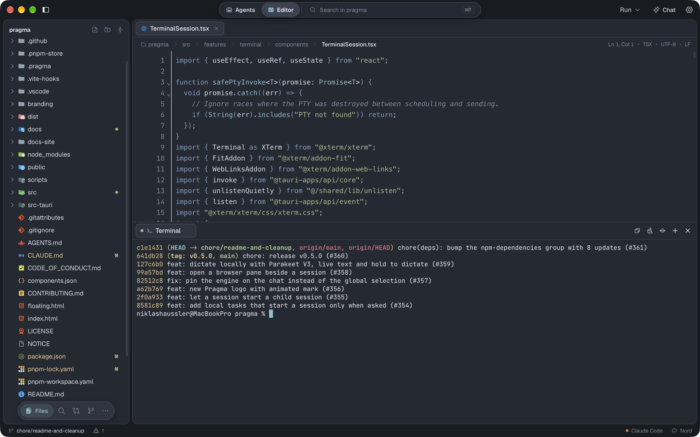
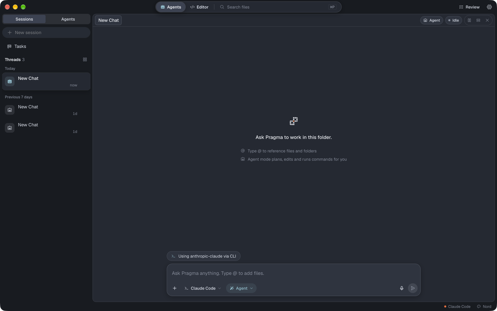
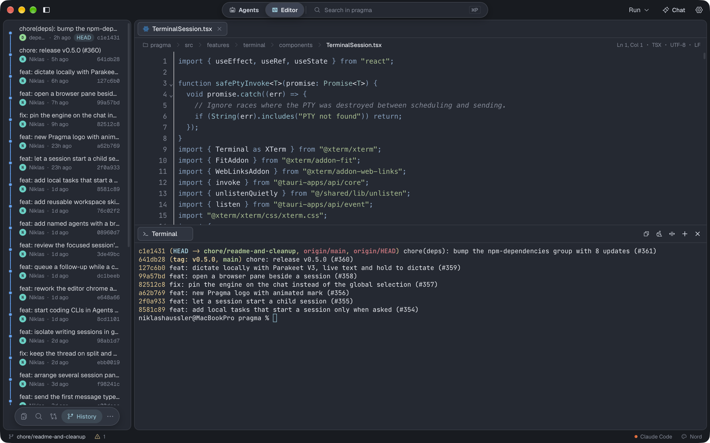
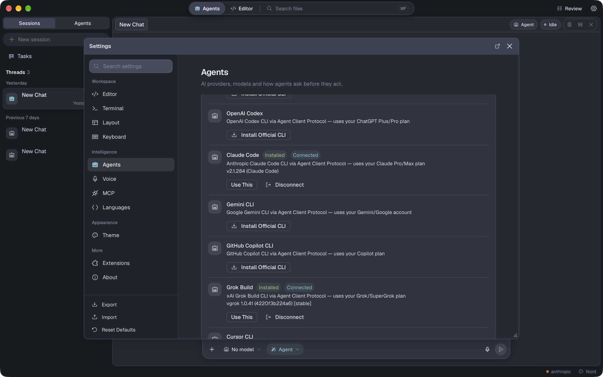

<p align="center">
  
</p>

<h1 align="center">Pragma</h1>

<p align="center">
  An AI-native desktop IDE that combines an agent workspace with a full code editor.
  <br>
  Built with Tauri 2, Rust, React 19, TypeScript and CodeMirror 6.
</p>

<p align="center">
  <a href="https://github.com/NiklasTech/pragma/releases">Download</a> ·
  <a href="https://niklastech.github.io/pragma/">Documentation</a> ·
  <a href="CONTRIBUTING.md">Contributing</a> ·
  <a href="https://discord.gg/VYBaBvcpGp">Discord</a>
</p>

<p align="center">
  
</p>

---

## Contents

- [What is Pragma?](#what-is-pragma)
- [Features](#features)
- [Installation](#installation)
- [Build from source](#build-from-source)
- [Quick start](#quick-start)
- [Configuration](#configuration)
- [Project structure](#project-structure)
- [Tech stack](#tech-stack)
- [Contributing](#contributing)
- [Third-party CLI tools](#third-party-cli-tools)
- [License](#license)

---

## What is Pragma?

Pragma is a desktop IDE with two modes in one window:

- **Agents** is a workspace for directing AI. You start sessions, give them a task and review what they changed.
- **Editor** is a complete hands-on IDE with a file tree, language servers, Git, a terminal and a debugger.

Both modes share the same project, the same terminal and the same AI providers. You can switch between them at any time with `Cmd/Ctrl + Shift + E`.

Pragma is built with Tauri and Rust instead of Electron, stores API keys in the operating system keychain and can use your existing coding CLI subscriptions such as Claude Code, Codex or Gemini CLI.

Pragma is in active development (0.x). Expect breaking changes between minor versions.

---

## Features

### Agents workspace

<p align="center">
  
</p>

- Sessions with a thread list, a transcript and a large composer.
- Several session panes side by side, each with its own conversation.
- Writing sessions can run in isolated Git worktrees so parallel work does not collide.
- Review pane that shows the changes of the focused session next to it.
- Named agents with a brief, their own memory and approved folders.
- Reusable workspace skills and local tasks that start a session only when you ask.
- Sessions can start child sessions for sub-tasks.
- Queue a follow-up message while a run is still in progress.
- Browser pane beside a session, for example to check a local dev server.
- Voice dictation with Web Speech, local Whisper.cpp or local Parakeet V3.

### Editor

- CodeMirror 6 with syntax highlighting for many languages and optional Vim mode.
- Built-in LSP support: completion, hover, go to definition, peek definition, references, rename, formatting, signature help, code actions, inlay hints, folding and an outline panel.
- Find and replace in the current file and across the workspace.
- Problems panel with diagnostics from all language servers.
- AI inline completions and an AI edit flow with a side-by-side diff to accept or reject.
- Debugger with breakpoints, stepping and a debug panel.
- Run configurations for starting and restarting project processes.

### Terminal

- xterm.js terminal backed by portable-pty.
- Multiple tabs and split panes.
- Configurable shell (zsh, bash, fish, PowerShell).
- AI command suggestions while typing.
- Clickable links, for example to open a local dev server in the browser.

### Git

<p align="center">
  
</p>

- Commit history with a graph in the sidebar.
- Status panel with staged and unstaged changes and inline diffs.
- Stage, unstage, commit, push and pull from the UI.
- Branch switcher, stash panel, blame and a conflict editor.

### AI providers

- Built-in providers: Anthropic, OpenAI, Gemini, DeepSeek, Kimi, Grok, OpenRouter, GitHub Copilot, Ollama and OpenAI-compatible custom endpoints.
- Coding CLIs over the Agent Client Protocol: Claude Code, OpenAI Codex, Gemini CLI, GitHub Copilot CLI, Kimi Code, Grok Build, Cursor CLI, OpenCode, Hermes Agent and DeepSeek Harness.
- MCP servers can be added and managed in the settings.
- API keys are stored in the OS keychain.

### More

- Docker and Podman container overview with start, stop, logs, exec and Compose actions.
- Extensions with a workspace, file and editor API.
- Built-in themes plus importable custom themes.
- Configurable keyboard shortcuts and a command palette.
- Resizable panels and native floating windows for detached panels.

---

## Installation

Pre-built installers for Windows, macOS and Linux are available on the [Releases](https://github.com/NiklasTech/pragma/releases) page.

> [!NOTE]
> The installers are not code-signed yet. Windows may show a SmartScreen warning, and macOS may ask you to confirm the first launch.

### Windows

1. Download `Pragma_<version>_x64-setup.exe` or `Pragma_<version>_x64_en-US.msi`.
2. Run the installer.
3. Start Pragma from the Start menu.

### macOS

1. Download `Pragma_<version>_universal.dmg`. It runs on Apple Silicon and Intel.
2. Open the DMG and drag Pragma into the Applications folder.
3. If Gatekeeper blocks the first launch, right-click the app and choose **Open**.

### Linux

1. Download the package for your distribution:
   - Debian and Ubuntu: `Pragma_<version>_amd64.deb`
   - Fedora and openSUSE: `Pragma-<version>-1.x86_64.rpm`
   - Any distribution: `Pragma_<version>_amd64.AppImage`
2. Install the package, or make the AppImage executable with `chmod +x Pragma_*.AppImage`.
3. Start Pragma from your application menu or by running the AppImage.

Installed versions check for updates and can update themselves.

---

## Build from source

### Prerequisites

- [Node.js](https://nodejs.org/) 24 or later
- [pnpm](https://pnpm.io/) 11.5.0 or later
- [Rust](https://www.rust-lang.org/tools/install) stable toolchain
- The Tauri system dependencies for your operating system

**macOS**

```bash
xcode-select --install
```

**Windows**

Install the [Microsoft C++ Build Tools](https://learn.microsoft.com/en-us/windows/dev-environment/rust/setup) with the Windows SDK.

**Linux (Debian and Ubuntu)**

```bash
sudo apt update
sudo apt install libwebkit2gtk-4.1-dev libgtk-3-dev libappindicator3-dev librsvg2-dev patchelf
```

**Linux (Arch and CachyOS)**

```bash
sudo pacman -S webkit2gtk-4.1 gtk3 libappindicator librsvg patchelf
```

For other distributions, see the [Tauri prerequisites guide](https://v2.tauri.app/start/prerequisites/).

### Clone and run

```bash
git clone https://github.com/NiklasTech/pragma.git
cd pragma
pnpm install
pnpm run dev:desktop
```

### Scripts

| Command                  | Purpose                             |
| ------------------------ | ----------------------------------- |
| `pnpm run dev`           | Frontend dev server only            |
| `pnpm run dev:desktop`   | Full desktop app in development     |
| `pnpm run build`         | Frontend production build           |
| `pnpm run build:desktop` | Desktop release build               |
| `pnpm run check`         | Lint, format check and type check   |
| `pnpm run test`          | Frontend tests                      |
| `cargo test`             | Rust tests (run inside `src-tauri`) |

Pragma uses [Vite+](https://viteplus.dev/) as its toolchain. The scripts above call `vp` through `pnpm exec`, so no global install is needed.

Release bundles are written to `src-tauri/target/release/bundle/`. To build only specific formats, pass them to Tauri, for example:

```bash
pnpm exec vp run tauri build --bundles deb,rpm
```

---

## Quick start

1. Start Pragma and complete the onboarding.
2. Choose a theme and connect an AI provider, either with an API key or by signing in to a coding CLI.
3. Open a project folder.
4. In **Agents**, describe a task in the composer and start a session.
5. Switch to **Editor** with `Cmd/Ctrl + Shift + E` to work on the code yourself.

Useful default shortcuts (`Cmd` on macOS, `Ctrl` on Windows and Linux):

| Shortcut               | Action                   |
| ---------------------- | ------------------------ |
| `Cmd/Ctrl + P`         | Go to file               |
| `Cmd/Ctrl + Shift + P` | Command palette          |
| `Cmd/Ctrl + Shift + E` | Switch Agents and Editor |
| `Cmd/Ctrl + Shift + A` | Toggle AI chat           |
| `Cmd/Ctrl + Shift + T` | Toggle terminal          |
| `Cmd/Ctrl + ,`         | Open settings            |

All shortcuts can be changed in **Settings > Keyboard**.

---

## Configuration

Everything is configured in the settings panel (`Cmd/Ctrl + ,`). Settings can be exported and imported as a file.

<p align="center">
  
</p>

### AI providers

In **Settings > Agents** you can:

- Save an API key for a built-in provider. Keys are stored in the OS keychain.
- Install and sign in to a coding CLI and select it with **Use This**. The CLI then runs your sessions with your existing subscription.

### MCP servers

MCP servers are added and started in **Settings > MCP**. The configuration is stored as `mcp.json` in the app configuration folder:

- macOS: `~/Library/Application Support/dev.pragma.ide/`
- Linux: `~/.config/dev.pragma.ide/`
- Windows: `%APPDATA%\dev.pragma.ide\`

### Themes

Built-in themes are selected in **Settings > Theme**, where you can also import your own themes.

More details are in the [documentation](https://niklastech.github.io/pragma/).

---

## Project structure

```
.
├── src/                 React frontend
│   ├── app/             Application entry
│   ├── components/      Shared UI such as onboarding
│   ├── features/        Feature modules (ai, editor, terminal, sidebar, debug, ...)
│   ├── shared/          Hooks, stores, UI components and utilities
│   ├── shell/           Window chrome and layout
│   └── theme/           Theme system
├── src-tauri/           Rust backend (Tauri commands, PTY, AI, Git, LSP, MCP)
├── docs/                Developer documentation
├── docs-site/           User documentation (VitePress)
├── branding/            Logo and brand assets
├── public/              Static assets
└── scripts/             Build and asset scripts
```

---

## Tech stack

| Layer             | Technology                                |
| ----------------- | ----------------------------------------- |
| Desktop framework | Tauri 2                                   |
| Backend           | Rust, portable-pty                        |
| Frontend          | React 19, TypeScript                      |
| Styling           | Tailwind CSS v4, shadcn/ui                |
| State             | Zustand                                   |
| Editor            | CodeMirror 6                              |
| Terminal          | xterm.js                                  |
| AI                | Vercel AI SDK, MCP, Agent Client Protocol |
| Toolchain         | Vite+, pnpm                               |

---

## Contributing

Contributions are welcome. [CONTRIBUTING.md](CONTRIBUTING.md) covers the development setup, branching model, commit conventions and pull request process.

Questions, ideas or just want to chat? Join the [Pragma Discord](https://discord.gg/VYBaBvcpGp).

Please report security issues privately as described in [SECURITY.md](SECURITY.md), not as a public issue.

---

## Third-party CLI tools

Pragma can work with official coding CLIs that are installed and run locally on your machine, such as Claude Code, OpenAI Codex, Gemini CLI or Kimi Code. When you use this integration:

- Pragma does not provide models, API access, accounts or credentials.
- The official CLI is downloaded from the provider's public package registry and installed on your system.
- Sign-in, billing and data processing happen directly between you and the provider.
- Pragma only starts the locally installed CLI and shows its output.

Each CLI is subject to its provider's license, terms and policies. Pragma is not affiliated with any of these providers.

---

## License

Pragma is licensed under the [Apache License 2.0](LICENSE).

Pragma builds on many open-source projects, including Tauri, CodeMirror, xterm.js, React and the Vercel AI SDK. The full list of third-party licenses is shown in **Settings > About**.
